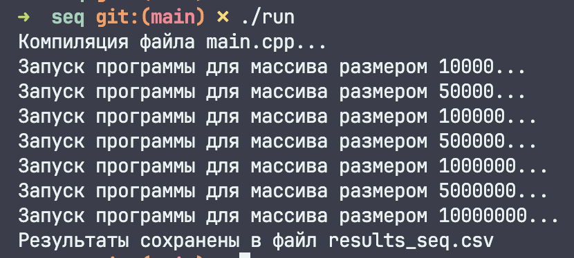
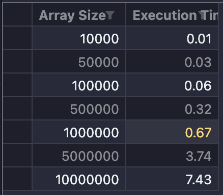
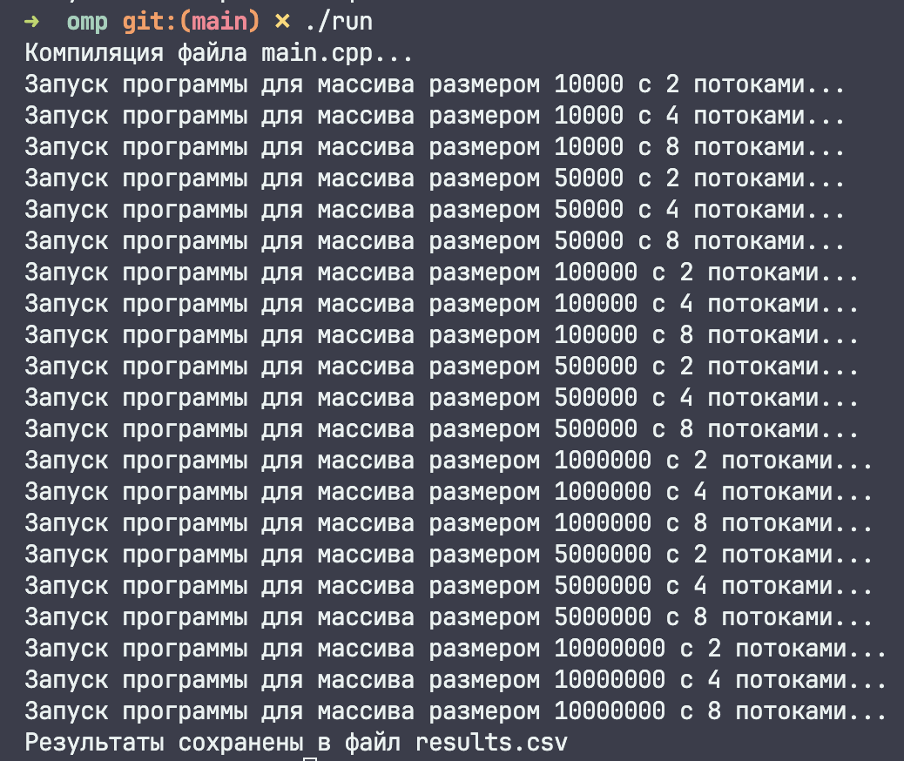
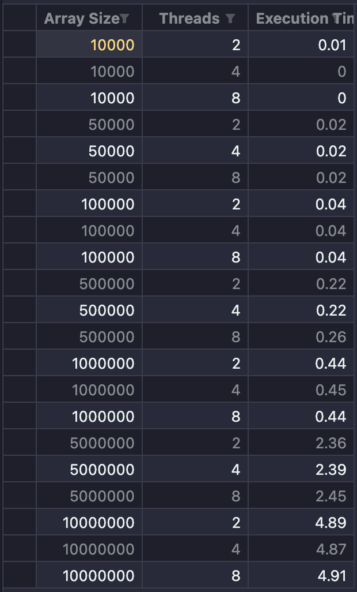
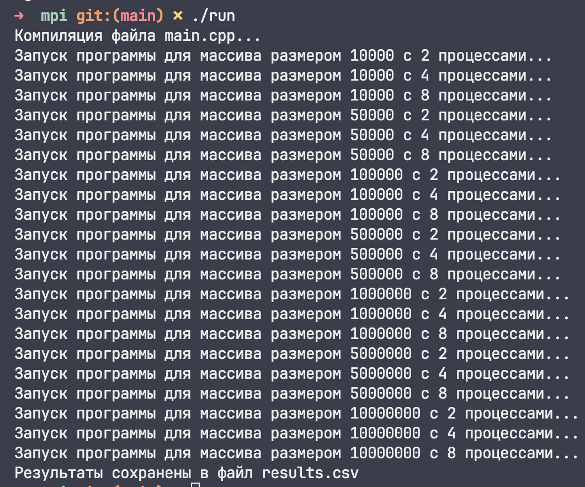
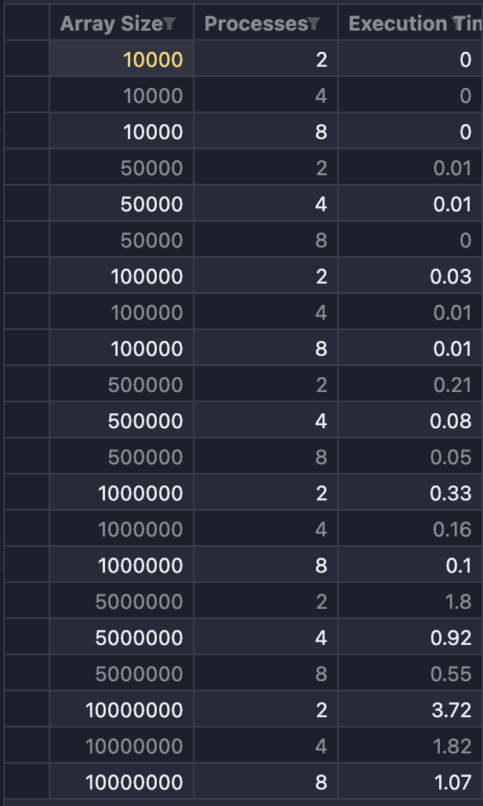
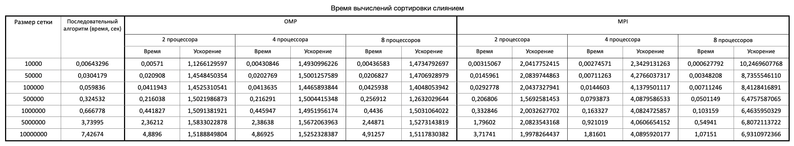
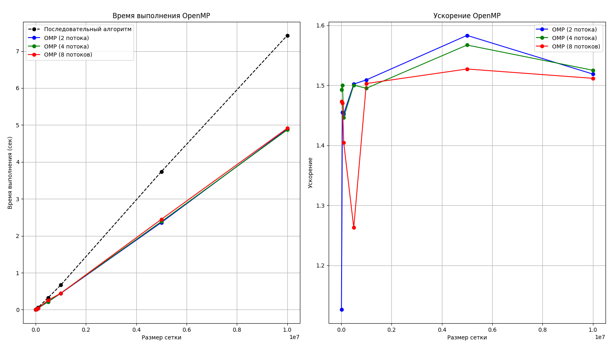
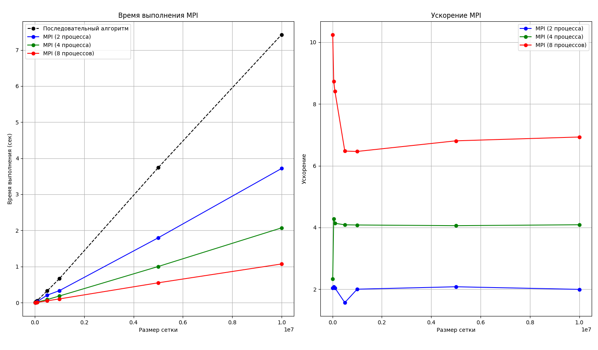

# Семинары 9-10

## Замечание

Для удобства для каждого алгоритма был написан скрипт `./run`, позволяющий удобно запустить каждую программу, а также сохранить результаты ее работы в файл.

## Работа программ

### Последовательный алгоритм

### OMP

### MPI

## Результаты

### Таблица

После перенесения результатов работы каждого алгоритма была составлена таблица, которая наглядно сравнивает алгоритмы.

### Графики

#### OMP

#### MPI

## Вывод

**OpenMP**: С увеличением количества потоков время выполнения уменьшается, однако ускорение стабилизируется при больших размерах сетки. Это указывает на ограничение в масштабируемости OpenMP на текущей аппаратной платформе.

**MPI**: Ускорение значительно увеличивается с ростом числа процессов, особенно при обработке больших объемов данных. Это демонстрирует высокую эффективность MPI для задач с большими данными на данной платформе.

В целом, MPI показывает лучшую производительность по сравнению с OpenMP для задач с большими объемами данных на текущей аппаратной платформе.