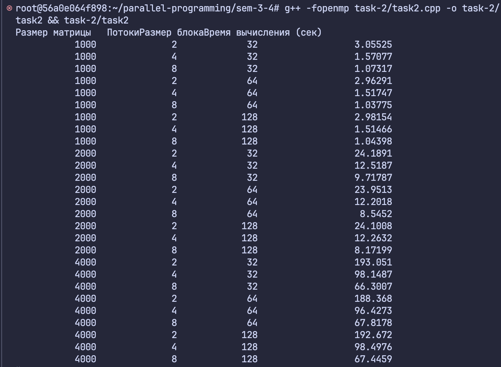
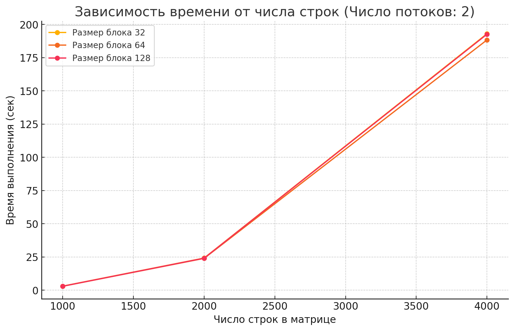
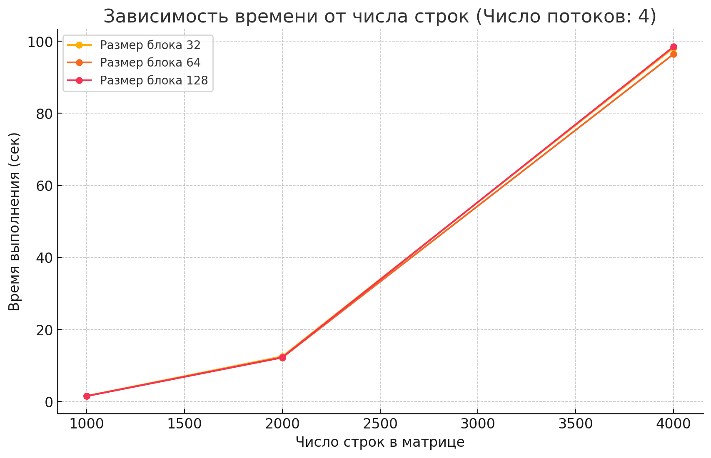
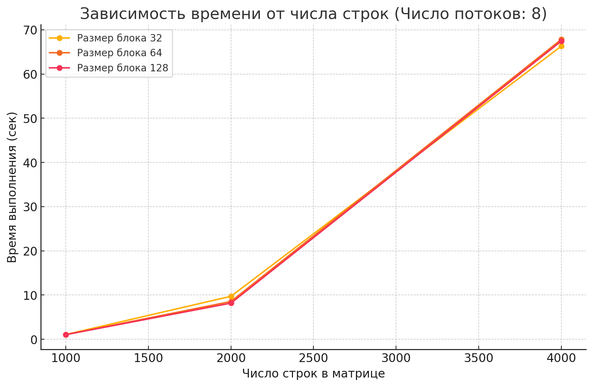
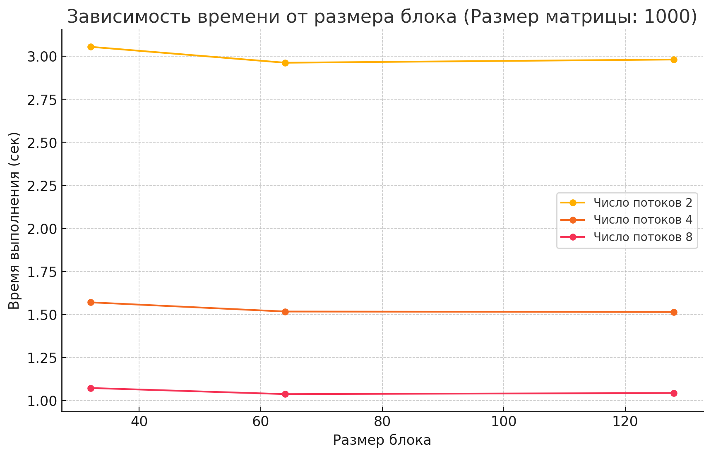
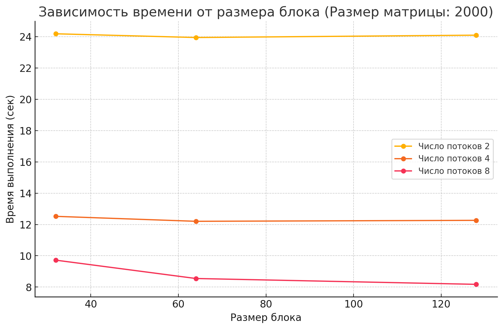
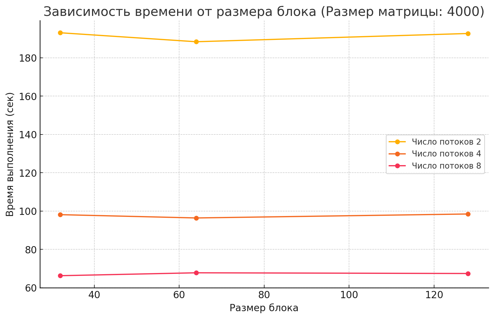

# Задание 3

## Демонстрация работы

## Графики

### Зависимость времени от количества строк для 2, 4 и 8 потоков

  

### Зависимость времени от размера блока для 1000, 2000 и 4000 строчек

  