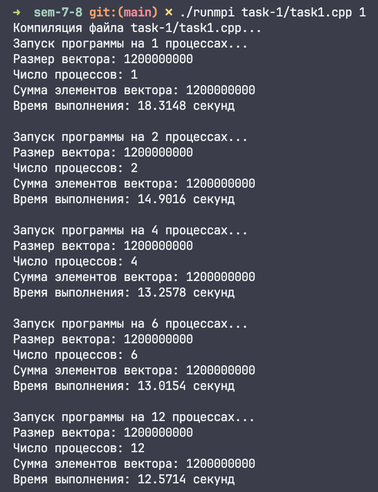
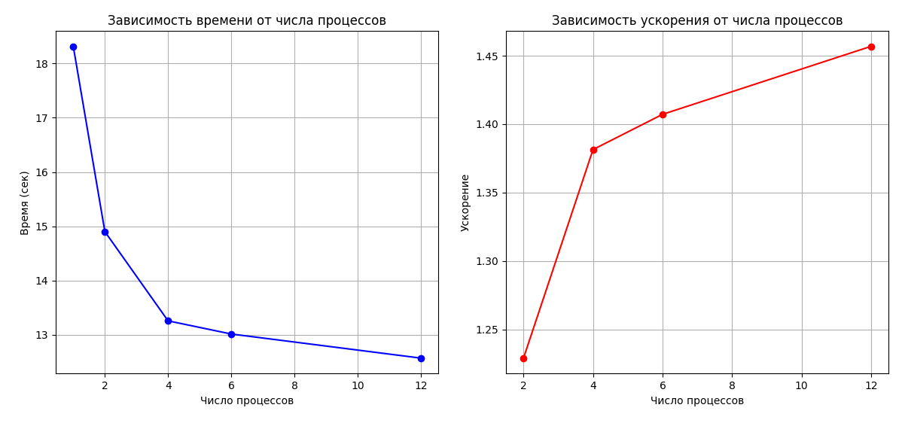

# Задание 1

## Демонстрация работы

## Графики

## Замечание

Стоит заметить, что было намеренно взято бОльшее количество элементов, так как прирост производительности не был замечен на исходном количестве элементов и получалась картина, как в задании 2, где с ростом количества процессов общая производительность падала.
