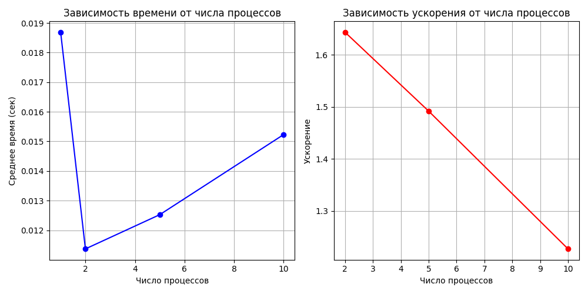

# Задание 2

## Демонстрация работы

## Графики

## Замечание

Стоит заметить, что ускорение падает с ростом количества процессов, это связано с тем, что параллельные накладные расходы (обмен данными, синхронизация) начинают преобладать над реальными вычислениями. Поэтому для демонстрации настоящего ускорения стоит брать большое количество обрабатываемых элементов, как в задании 1.
