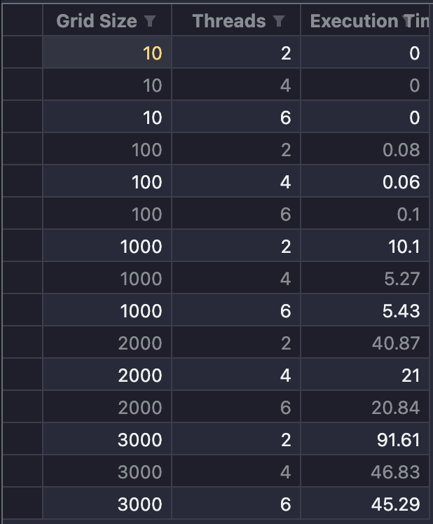

# Семинары 9-10

## Замечание

Для удобства для каждого алгоритма был написан скрипт `./run`, позволяющий удобно запустить каждую программу, а также сохранить результаты ее работы в файл.

## Работа программ

### Последовательный алгоритм

### OMP

### MPI

## Результаты

### Таблица

После перенесения результатов работы каждого алгоритма была составлена таблица, которая наглядно сравнивает алгоритмы. Было добавлено условное форматирование для ускорения: красный цвет - ускорения нет, оранжевый цвет - ускорение от 1 до 2, желтый цвет - ускорение от 2 до 3 и зеленый цвет - ускорение от 3 и более.

### Графики

#### OMP

#### MPI

## Вывод

OpenMP: Уменьшается с увеличением количества потоков, но ускорение стабилизируется при больших размерах сетки.

MPI: Более выраженное увеличение ускорения с числом процессов, особенно при больших объемах данных.

MPI более эффективен на текущей аппаратной платформе для задач с большими объемами данных по сравнению с OpenMP.